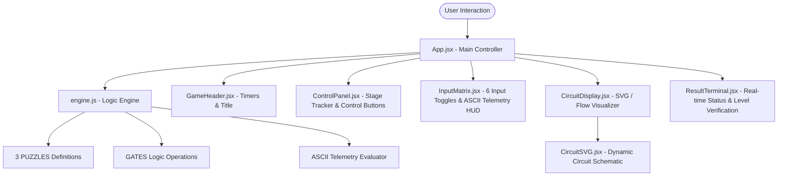

# 🧠 BRAIN.MD — Minotaur Logic Simulator Technical Documentation

> **Project Name:** Minotaur Logic Simulator — *The Minotaur's Gates*  
> **Version:** 2.0.0  
> **Stack:** React 18 · Vite · Tailwind CSS · Vitest  
> **Theme:** Cinematic Odyssey & Deep Space Cybernetic  

---

## 📋 Table of Contents
1. [Project Overview & Core Concept](#1-project-overview--core-concept)
2. [Architectural Overview & Data Flow](#2-architectural-overview--data-flow)
3. [Logic Engine & Mathematics (`src/engine.js`)](#3-logic-engine--mathematics-srcenginejs)
4. [The 3 Hardcore Levels Specifications](#4-the-3-hardcore-levels-specifications)
5. [Compulsory Node Locks & Telemetry Decimals](#5-compulsory-node-locks--telemetry-decimals)
6. [Level 3 Final Master Verification Phrase](#6-level-3-final-master-verification-phrase)
7. [UI Component Architecture](#7-ui-component-architecture)
8. [Design System & Aesthetic Palette](#8-design-system--aesthetic-palette)
9. [Development, Testing & Build Commands](#9-development-testing--build-commands)

---

## 1. Project Overview & Core Concept

**The Minotaur's Gates** is an interactive, Odyssey-themed logic circuit simulator. Players take on the role of a contestant attempting to breach 3 streamlined digital security gates guarding the core of the Minotaur's Labyrinth.

### Core Objectives:
- Toggle **6 binary inputs** ($A, B, C, D, E, F$) between `0` and `1`.
- Satisfy **7-gate 3-layer combinational circuits** ($G_1$ through $G_7$) to produce the target output bit ($0$ or $1$) at $G_7$.
- Adhere to compulsory **fixed input lock constraints** (e.g., $A=1$, $D=0$) without which levels cannot be solved.
- Observe real-time 6-bit binary to **decimal ASCII telemetry** ($A \to F$).
- Collect 3 unlocked cipher words across stages to reveal the **Final Master Verification Phrase**.

---

## 2. Architectural Overview & Data Flow



---

## 3. Logic Engine & Mathematics (`src/engine.js`)

### 3.1 Topology & Circuit Structure
The circuit consists of **6 inputs** and **7 logic gates** arranged in **3 hierarchical layers**:

- **Inputs:** `A`, `B`, `C`, `D`, `E`, `F` $\in \{0, 1\}$
- **Layer 1 (Input Gates):**
  - $G_1 = f(A, B)$
  - $G_2 = f(B, C)$
  - $G_3 = f(D, E)$
  - $G_4 = f(E, F)$
- **Layer 2 (Intermediate Gates):**
  - $G_5 = f(G_1, G_2)$
  - $G_6 = f(G_3, G_4)$
- **Layer 3 (Final Output Gate):**
  - $G_7 = f(G_5, G_6)$

### 3.2 Real-time ASCII Telemetry (`inputsToAscii`)
The 6 binary input states are evaluated as a 6-bit binary integer to generate real-time ASCII telemetry:
$$\text{Code} = (A \cdot 32) + (B \cdot 16) + (C \cdot 8) + (D \cdot 4) + (E \cdot 2) + (F \cdot 1)$$
- Printable ASCII characters ($32 \le \text{Code} \le 126$) display the character.
- Non-printable ASCII values display a placeholder dot `•`.

---

## 4. The 3 Hardcore Levels Specifications (Strict 6-Bit Boolean Locks)

Each level acts as a **strict 6-bit Boolean lock**, mathematically designed so that out of all $2^6 = 64$ possible binary input combinations ($A–F$), **EXACTLY ONE** combination yields `finalOutput === puzzle.target`.

| Level | Name | Gate Topology ($G_1 \dots G_7$) | Target Output | Fixed Input Locks | Single Solution ($A \dots F$) | Telemetry Dec (ASCII) |
| :---: | :--- | :--- | :---: | :---: | :---: | :---: |
| **01** | The Gorgon’s Labyrinth | `OR, NOR, OR, NOR, AND, NOR, AND` | `1` | `A: 1, D: 0` | `100001` | **33 (`!`)** |
| **02** | Titan’s Parity Trap | `AND, NAND, OR, NOR, OR, OR, OR` | `0` | `B: 1, E: 0` | `011001` | **25 (`•`)** |
| **03** | Recursive Singularity | `AND, AND, OR, OR, AND, NOR, AND` | `1` | `C: 1, F: 0` | `111000` | **56 (`8`)** |

---

## 5. 64-Combination Exhaustive Boolean Validation

The gate evaluators guarantee that no secondary solutions exist. Out of all 64 possible binary input states:

- **Puzzle 01:** `100001` $\rightarrow$ `targetOutput = 1` (63 other inputs $\rightarrow$ `0` $\rightarrow$ FAIL).
- **Puzzle 02:** `011001` $\rightarrow$ `targetOutput = 0` (63 other inputs $\rightarrow$ `1` $\rightarrow$ FAIL).
- **Puzzle 03:** `111000` $\rightarrow$ `targetOutput = 1` (63 other inputs $\rightarrow$ `0` $\rightarrow$ FAIL).

---

## 6. Level 3 Final Master Verification Phrase

When a contestant successfully completes Level 3 (clearing all 3 stages), all unlocked cipher words assemble into the official **Final Master Verification Phrase**:

$$\mathbf{\text{“MASTER THE LOGIC”}}$$

### Presentation:
- Displayed in `ResultTerminal.jsx` upon Level 3 clearance.
- Includes a **`📋 COPY VERIFICATION PHRASE`** button that copies the phrase to the clipboard.
- Featured on the Grand Victory Overlay dashboard upon completing the campaign.

---

## 7. UI Component Architecture

| Component | Path | Responsibility |
| :--- | :--- | :--- |
| **`App.jsx`** | `src/App.jsx` | Root state manager, level timer, stage progression, victory modal. |
| **`GameHeader.jsx`** | `src/components/GameHeader.jsx` | Header bar, active level timer, total timer, level indicator. |
| **`ControlPanel.jsx`** | `src/components/ControlPanel.jsx` | Stage progress tracker (✓ solved, active), reset/randomize input controls. |
| **`InputMatrix.jsx`** | `src/components/InputMatrix.jsx` | 6 interactive toggle buttons ($A$–$F$), compulsory lock tags, ASCII telemetry HUD. |
| **`CircuitDisplay.jsx`** | `src/components/CircuitDisplay.jsx` | Container for SVG schematic viewer with layout toggles. |
| **`CircuitSVG.jsx`** | `src/CircuitSVG.jsx` | Dynamic SVG renderer depicting gates $G_1$–$G_7$, signal wire states (high/low), and node labels. |
| **`ResultTerminal.jsx`** | `src/components/ResultTerminal.jsx` | Real-time output feedback terminal, breach notifications, and Final Verification Phrase banner. |

---

## 8. Design System & Aesthetic Palette

- **Background Void:** `#07111F` (Deep Space Navy)
- **Container Panel:** `#0D1B2A` / `#152538`
- **Border / Divider:** `#1E344D`
- **Odyssey Gold (Primary Accent):** `#F4C95D` (Titles, level indicators, victory highlights)
- **Aegean Cyan (Interactive Signal):** `#3DD6D0` (Active states, live wires)
- **Success Green:** `#48C78E` (Level breached, target output met)
- **Styx Coral (Error Accent):** `#E76F51` (Access denied, lock violation)
- **Typography:** `'Orbitron', sans-serif` & `'JetBrains Mono', monospace`

---

## 9. Development, Testing & Build Commands

```bash
# Run Vitest unit tests once
npm test -- --run

# Compile production bundle
npm run build
```

---
*Documentation automatically updated for Version 2.0.0 (3-Level Streamlined Circuit Engine).*
